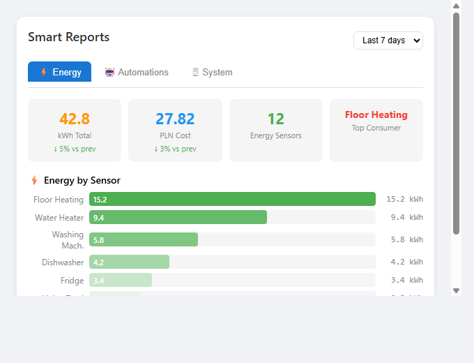

# Home Assistant Smart Reports

[](https://github.com/MacSiem/ha-smart-reports/actions/workflows/validate.yml)
[](https://github.com/hacs/integration)

A Lovelace card for Home Assistant that provides energy reports, automation statistics, and system health overview in one dashboard card.



## Features

- **Energy tab**: consumption by sensor, cost estimation, top consumers bar chart
- **Automations tab**: total/active/disabled count, recent activity list, trigger frequency
- **System tab**: entity count by domain, health check (unavailable/unknown states)
- Export reports to CSV or JSON
- Configurable time period (today, 7 days, 30 days)
- Light and dark theme support

## Installation

### HACS (Recommended)

1. Open HACS in your Home Assistant
2. Go to Frontend → Explore & Download Repositories
3. Search for "Smart Reports"
4. Click Download

### Manual

1. Download `ha-smart-reports.js` from the [latest release](https://github.com/MacSiem/ha-smart-reports/releases/latest)
2. Copy it to `/config/www/ha-smart-reports.js`
3. Add the resource in Settings → Dashboards → Resources:
   - URL: `/local/ha-smart-reports.js`
   - Type: JavaScript Module

## Usage

Add the card to your dashboard:

```yaml
type: custom:ha-smart-reports
title: Smart Reports
currency: PLN
energy_price: 0.65
```

### Configuration

| Option | Type | Default | Description |
|--------|------|---------|-------------|
| `title` | string | `Smart Reports` | Card title |
| `energy_entity` | string | `null` | Main energy sensor entity ID |
| `show_energy` | boolean | `true` | Show Energy tab |
| `show_automations` | boolean | `true` | Show Automations tab |
| `show_system` | boolean | `true` | Show System tab |
| `currency` | string | `PLN` | Currency symbol for cost |
| `energy_price` | number | `0.65` | Price per kWh |

## Screenshots

| Energy | Automations | System |
|:------:|:-----------:|:------:|
|  |  |  |

## License

MIT License - see [LICENSE](LICENSE) file.
