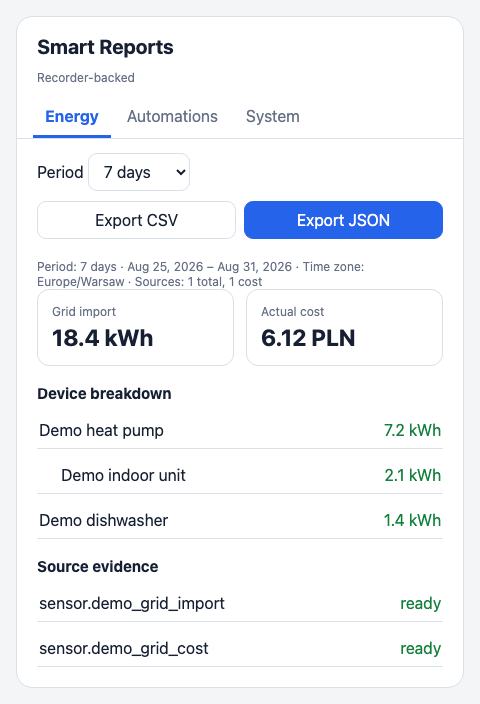
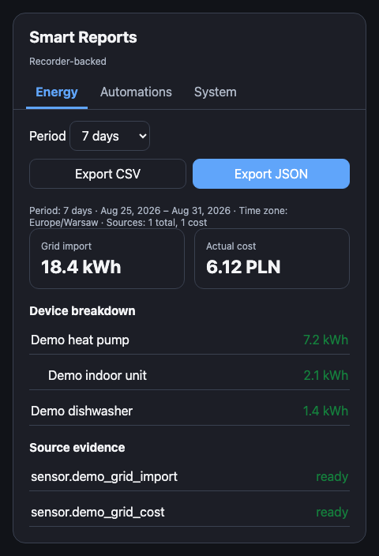

# Smart Reports

Lovelace card with an at-a-glance energy, automation and system-health report
for Home Assistant — three tabs, computed from your current entity states,
with CSV/JSON export. Zero configuration: add the card and it works.

[](https://www.home-assistant.io/) [](https://github.com/MacSiem/ha-smart-reports/releases) [](LICENSE)

Part of the [HA Tools](https://github.com/MacSiem) ecosystem.

## How it works

**Short version: it works automatically.** The card needs no configuration —
add it and it reads your current Home Assistant states directly.

1. **Energy sensors, auto-detected.** Any entity whose id contains `energy`,
   `power` or `consumption` is picked up automatically, ranked by value, and
   shown as a bar chart with an estimated cost (`energy_price` × total kWh).
2. **Automation stats from state.** Every `automation.*` entity's state and
   `last_triggered` attribute is read to show total / active / disabled /
   triggered-today counts and a recent-activity list.
3. **System health from your entity registry.** Total entities, domain
   breakdown and `unavailable`/`unknown` counts come straight from
   `hass.states` — no separate health-check integration required.
4. **Export what's on screen.** The Export CSV / Export JSON buttons dump the
   current three-tab summary (energy, automations, system) to a downloaded
   file, generated client-side in your browser.

> **The period selector (Today / 7 days / 30 days) is a label, not a filter.**
> Smart Reports reads live states only — it does not call the history or
> statistics APIs. Changing the period does not change any number on screen;
> it only tags the exported report with that period string. Treat every tab
> as a snapshot of *right now*, not a historical trend.

> **The visual-editor stub isn't a required field.** Home Assistant's card
> picker preloads a stub config (`energy_entity: sensor.energy_total`) so the
> live preview isn't empty. The card never reads `energy_entity` — it
> auto-discovers energy sensors by entity-id pattern, so you can delete that
> line from your dashboard YAML with no effect.

### What is automatic vs. manual

| Automatic | Manual (optional) |
|---|---|
| Discovering energy/power/consumption sensors | Setting `energy_price` / `currency` for the cost estimate |
| Automation active/disabled/triggered-today counts | Hiding a tab (`show_energy` / `show_automations` / `show_system`) |
| Domain breakdown + unavailable/unknown health check | Exporting the current snapshot (CSV/JSON button click) |
| Light/dark theme (follows your HA theme) | — |

## Screenshots

| Light | Dark |
|---|---|
|  |  |

*Default view: the Energy tab, showing the auto-detected sensor ranking and
estimated cost. Automations and System are one click away. Dark mode follows
your Home Assistant theme automatically.*

## Installation

### HACS (custom repository)

1. Open HACS → Frontend (Dashboard) → ⋮ → **Custom repositories**.
2. Add `https://github.com/MacSiem/ha-smart-reports` with category
   **Dashboard** (Lovelace plugin).
3. Install **Smart Reports** and reload your browser.

### Manual

1. Download `ha-smart-reports.js` from the
   [latest release](https://github.com/MacSiem/ha-smart-reports/releases).
2. Copy to `/config/www/community/ha-smart-reports/`.
3. Add as a Lovelace resource:
   `/local/community/ha-smart-reports/ha-smart-reports.js` (type: `module`).

## Quick start

```yaml
type: custom:ha-smart-reports
```

That's it — no options are required. All config keys are optional:

```yaml
type: custom:ha-smart-reports
title: Smart Reports
energy_price: 0.65
currency: PLN
show_energy: true
show_automations: true
show_system: true
```

## FAQ

**Do I have to configure anything?**
No. Add the card and it reads your existing entities — energy sensors,
automations and the entity registry — automatically.

**What is `energy_entity` in the stub config for?**
Nothing, functionally. It's a placeholder Home Assistant's visual editor
preloads so the card preview isn't blank; the card doesn't read that key. It
auto-detects energy sensors by matching `energy`/`power`/`consumption` in the
entity id, regardless of what (if anything) `energy_entity` is set to.

**Can I see historical reports, e.g. energy use last month?**
Not yet. Every tab is computed from the current `hass.states` snapshot only —
there's no call to Home Assistant's history or statistics APIs. The
Today/7‑days/30‑days selector only labels the exported file; it doesn't
change what's shown or exported.

**Does it send scheduled or emailed reports?**
No — Smart Reports is a dashboard viewer only. For scheduled/emailed digests,
install the **HA Tools Email** integration plus the dedicated `ha-log-email` /
`ha-energy-email` cards (separate HACS repositories).

**Does this send data anywhere?**
No. There are no external network calls, no telemetry, no CDN-hosted assets —
everything is rendered locally in your browser from your own Home Assistant
instance's state.

## Changelog

See [CHANGELOG.md](CHANGELOG.md).

## Support

- [Buy Me a Coffee](https://buymeacoffee.com/macsiem)
- [PayPal](https://www.paypal.com/donate/?hosted_button_id=Y967H4PLRBN8W)

## License

MIT, see [LICENSE](LICENSE).
