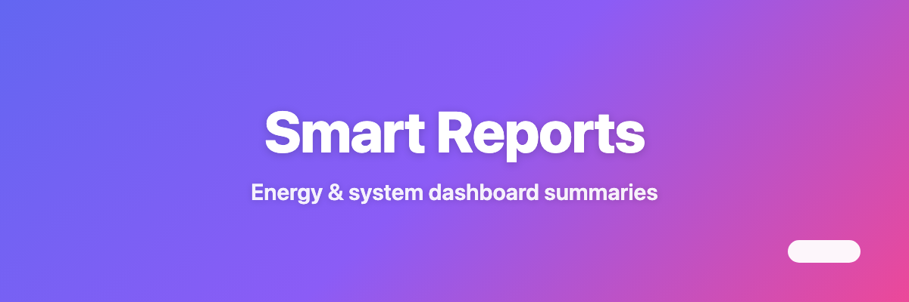
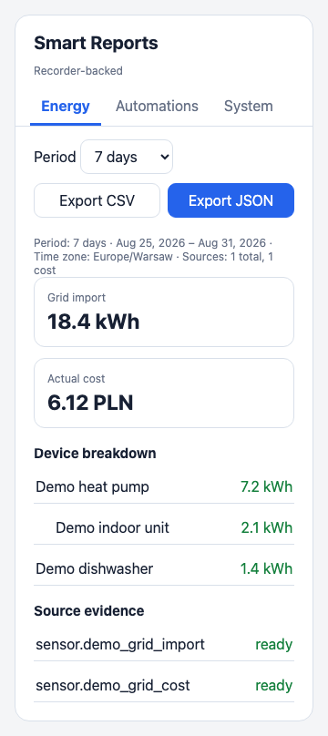

# Smart Reports



Smart Reports is a Lovelace card with three focused views:

- historical energy and cost reporting from Home Assistant Recorder statistics;
- automation status and recent activity from `automation.*` entities;
- entity/domain health from the current Home Assistant state registry.

[](https://www.home-assistant.io/) [](https://github.com/MacSiem/ha-smart-reports/releases) [](LICENSE)

Part of the [HA Tools](https://github.com/MacSiem) ecosystem.

## Energy data model

The Energy tab never estimates history from current entity states and never
discovers sensors by matching words in entity IDs. It reads Recorder
`change` statistics for an exact local-calendar window in
`hass.config.time_zone`.

The default source mode is `dashboard`:

1. `energy/get_prefs` supplies the grid-import, cost and device statistic IDs
   already configured in Home Assistant Energy.
   Current device entries use their `name` as the display label. If any grid
   source has no direct `stat_cost`, `energy/info` is queried only to fill
   those missing mappings; a direct cost source is never replaced.
2. Grid/root sources alone form the headline household total.
3. Device sources appear only in the breakdown. A source with
   `included_in_stat` is nested under its parent and is not ranked as a second
   top-level consumer.

Use `explicit` mode when the report should use a different declared set of
statistics. Total, device and cost roles are intentionally separate:

```yaml
type: custom:ha-smart-reports
energy_source_mode: explicit
energy_total_statistics:
  - sensor.grid_import_energy
energy_device_statistics:
  - statistic_id: sensor.heat_pump_energy
    label: Heat pump
  - statistic_id: sensor.heat_pump_indoor_energy
    label: Indoor unit
    included_in_stat: sensor.heat_pump_energy
energy_cost_statistics:
  - sensor.grid_import_cost
```

The legacy `energy_entity` option remains a compatibility alias for one
explicit total statistic when `energy_total_statistics` is empty. It does not
enable discovery or a live-state fallback.

### Accuracy and unavailable data

- Recorder metadata must declare a sum-capable energy statistic. Power and
  unknown/no-sum sources are rejected. `unit_class: energy` is required when
  present; exact `Wh`/`kWh`/`MWh` is the compatibility fallback only when the
  metadata has no unit class.
- Exact `Wh`, `kWh` and `MWh` units are normalized to kWh. String numerics,
  non-finite values, negative import changes, gaps and overlaps are not
  silently repaired.
- Today, 7-day and 30-day periods start at local midnight. DST days may be 23
  or 25 hours.
- If a required source is incomplete, invalid or has no samples, combined
  totals and cost are withheld instead of being shown as zero.
- The card distinguishes loading, not configured, unsupported, permission
  denied, request error, no data, partial data and ready states.

### Cost provenance

Configured cost statistics take precedence and are labeled **Actual cost**.
Their metadata unit must exactly match Home Assistant's configured currency
(`hass.config.currency`); volume, power, energy, mixed and foreign-currency
statistics are withheld.
If no cost statistics are configured, an estimate is available only when both
an explicit finite non-negative `energy_price` and a `currency` are supplied:

```yaml
type: custom:ha-smart-reports
energy_source_mode: dashboard
energy_price: 0.42
currency: PLN
```

There is no default tariff. A zero rate is valid and remains zero.

## Automations and System

The Automations tab keeps the live operational overview: total, active,
disabled, triggered-today counts and the ten most recent triggers. The System
tab shows entity/domain counts, unavailable/unknown states and availability
percentages. These two tabs are current-state summaries; the Energy period
selector does not change them.

## Export

Energy exports are generated locally in the browser:

- JSON uses `schema_version: 2` and includes period range, timezone, overall
  status, source mode, warnings, per-source total/cost evidence and device
  relationships.
- CSV is flat (one aggregate/source/device metric per row), retains source
  status/provenance/reason, contains no nested JSON and neutralizes
  formula-leading labels before download.

Export is disabled while a request is loading or failed, so an older period
cannot be downloaded as if it were current.

## Screenshots

The previews below use a deterministic, fully synthetic Recorder fixture. They
contain no production entity names, account data, addresses, network details,
tokens or household history.

| Light | Dark | Narrow |
|---|---|---|
|  |  |  |

[`docs/screenshots/manifest.json`](docs/screenshots/manifest.json) binds every
image to the exact `ha-smart-reports.js` SHA-256, fixed clock, locale, timezone
and browser build. The local screenshot gate renders every variant twice,
requires byte-identical PNG output, blocks non-loopback requests, rejects PNG
metadata, checks horizontal overflow and runs OCR privacy checks.

## Installation

### HACS (custom repository)

1. Open HACS → Frontend (Dashboard) → ⋮ → **Custom repositories**.
2. Add `https://github.com/MacSiem/ha-smart-reports` with category
   **Dashboard**.
3. Install **Smart Reports** and reload the browser.

### Manual

1. Download `ha-smart-reports.js` from the latest release.
2. Copy it to `/config/www/community/ha-smart-reports/`.
3. Add `/local/community/ha-smart-reports/ha-smart-reports.js` as a Lovelace
   module resource.

## Quick start

```yaml
type: custom:ha-smart-reports
```

This uses the Home Assistant Energy Dashboard configuration. If the Energy
Dashboard has no grid-import statistic, the card shows a configuration state
and links to `/config/energy`; it does not guess a sensor.

### Options

| Option | Type | Default | Description |
|---|---|---|---|
| `title` | string | `Smart Reports` | Card heading. |
| `energy_source_mode` | `dashboard` or `explicit` | `dashboard` | Exact source-selection policy. |
| `energy_total_statistics` | list | empty | Explicit root total statistic IDs. |
| `energy_device_statistics` | list | empty | Explicit device objects/IDs; objects may include `label` and `included_in_stat`. |
| `energy_cost_statistics` | list | empty | Explicit actual-cost statistic IDs. |
| `energy_entity` | string | none | Legacy one-total compatibility alias in explicit mode. |
| `energy_price` | number ≥ 0 | none | Explicit flat estimate rate per kWh. |
| `currency` | string | none | Required with `energy_price`. |
| `show_energy` | boolean | `true` | Show the Energy tab. |
| `show_automations` | boolean | `true` | Show the Automations tab. |
| `show_system` | boolean | `true` | Show the System tab. |

The visual editor safely exposes Title and Currency. Tab selection is local
to each card instance. If all three `show_*` flags are false, the card shows a
configuration message and performs no Home Assistant data requests.

## Privacy and limitations

The card uses Home Assistant's same-origin WebSocket API and the state object
already provided to Lovelace. It has no telemetry, analytics, remote fonts or
CDN dependency. Support links open only when clicked and use `noopener` and
`noreferrer`.

JSON/CSV exports are built locally and are not uploaded by the card. They can
contain the configured statistic IDs, display labels, report window, warnings
and measured values, so review an export before sharing it outside your Home
Assistant environment. The card never stores credentials, SMTP settings or
Home Assistant access tokens.

Recorder retention and source metadata determine how much historical energy
data is available. Smart Reports is an on-demand dashboard/export card; it
does not schedule or email reports.

## Changelog

See [CHANGELOG.md](CHANGELOG.md).

## Support

- [Buy Me a Coffee](https://buymeacoffee.com/macsiem)
- [PayPal](https://www.paypal.com/donate/?hosted_button_id=Y967H4PLRBN8W)

## License

MIT, see [LICENSE](LICENSE).
