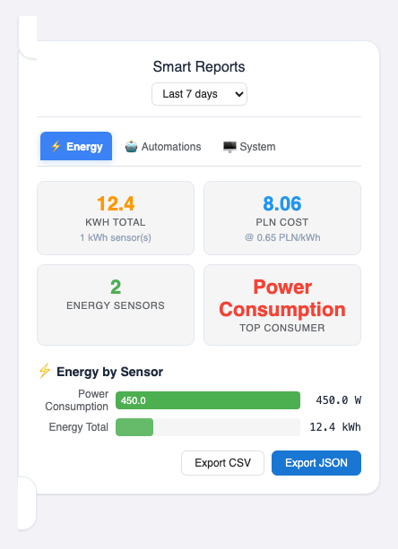

# 📈 Smart Reports

Lovelace card with energy reports, automation statistics and system health overview for Home Assistant.

[](https://www.home-assistant.io/) [](LICENSE)

Part of the [HA Tools](https://github.com/MacSiem/ha-tools-panel) collection for Home Assistant.

## Screenshot



## Installation

### HACS (custom repository)

1. Open HACS in Home Assistant.
2. Go to **Frontend** → ⋮ → **Custom repositories**.
3. Add `https://github.com/MacSiem/ha-smart-reports` with category **Lovelace**.
4. Install **Smart Reports** and restart Home Assistant.

### Manual

1. Download `ha-smart-reports.js` from the [latest release](https://github.com/MacSiem/ha-smart-reports/releases).
2. Copy to `/config/www/community/ha-smart-reports/`.
3. Add as a Lovelace resource: `/local/community/ha-smart-reports/ha-smart-reports.js` (type: `module`).

## Usage

```yaml
type: custom:ha-smart-reports
```

## Privacy

- No telemetry, no analytics, no tracking.
- No external network calls, no CDN-hosted assets (system fonts only).
- All report data is rendered from your Home Assistant state — nothing leaves your instance.

## Changelog

See [CHANGELOG.md](CHANGELOG.md).

## License

MIT — see [LICENSE](LICENSE).